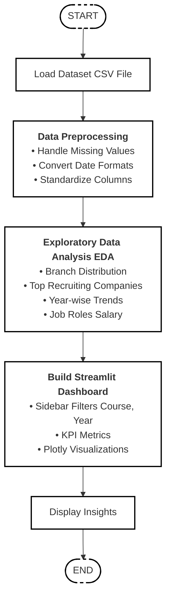

# Python
This is my repository for Learning Python and it's libraries

```mermaid
graph TD
    A([START]) --> B[Load Dataset CSV File]
    B --> C[<b>Data Preprocessing</b><br/>• Handle Missing Values<br/>• Convert Date Formats<br/>• Standardize Columns]
    C --> D[<b>Exploratory Data Analysis EDA</b><br/>• Branch Distribution<br/>• Top Recruiting Companies<br/>• Year-wise Trends<br/>• Job Roles Salary]
    D --> E[<b>Build Streamlit Dashboard</b><br/>• Sidebar Filters Course, Year<br/>• KPI Metrics<br/>• Plotly Visualizations]
    E --> F[Display Insights]
    F --> G([END])

    style A fill:#ffffff,stroke:#000,stroke-width:2px,stroke-dasharray: 5 5
    style B fill:#ffffff,stroke:#000,stroke-width:2px
    style C fill:#ffffff,stroke:#000,stroke-width:2px
    style D fill:#ffffff,stroke:#000,stroke-width:2px
    style E fill:#ffffff,stroke:#000,stroke-width:2px
    style F fill:#ffffff,stroke:#000,stroke-width:2px
    style G fill:#ffffff,stroke:#000,stroke-width:2px,stroke-dasharray: 5 5
```
